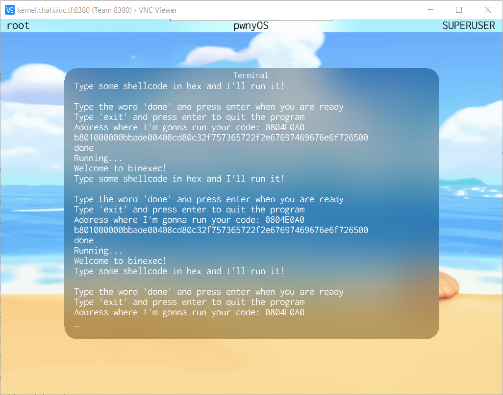
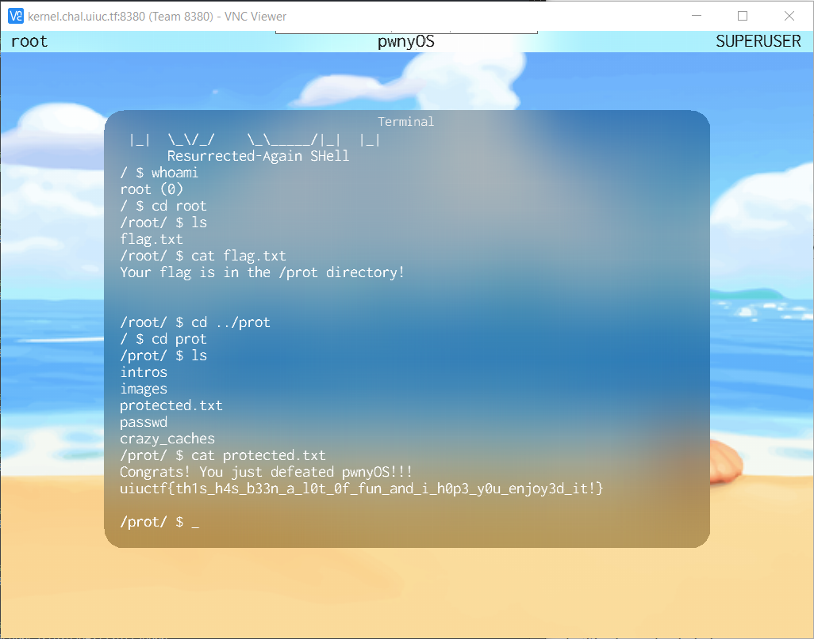

# Exploiting a useless file to perform a useful task
<!-- cSpell:ignore sandb -->
**Writeup Author:** Kevin He (Username `trinary-exploitation`)  
**Category:** Kernel Exploitation
> ## Kernel::Run_it_as_Root
> There's a bug with uninitialized memory in the kernel page allocator. Can you find a way to exploit this bug with your new user-level permissions to execute rash as root (UID 0)?
>
> Prerequisite: this challenge requires a UID of 1 to complete, so you need to solve `crazy_caches` first.
>
> Author: ravi

The first step to every Kernel Exploitation challenge is to read the [pwnyOS documentation](https://github.com/sigpwny/pwnyOS-2020-docs). Quoting from the documentation:
> Our intention is that everything you
need to complete these challenges is provided to you- no guessing is involved.

This problem is not an exception. Despite being worth 666 points, careful reading of the documentation and some basic understanding of x86 assembly is all we need to defeat the challenge. With that said, let's see what we can do with our newly gained user privilege:

System calls available to `user` but not for `sandb0x` (with syscall numbers):
- 10 `SWITCH_USER`
- 11 `GET_USER`
- 12 `REMOTE_SETUSER`
- 13 `MMAP`

A lot of those syscalls are related to user management, but elevating to root based solely on those is not practical. They either require the correct root password (`SWITCH_USER` or `su` command) or require existing root privileges (`REMOTE_SETUSER`) in some process on the system. Unlike the previous `Crazy_Caches` challenge, there are no existing processes running as root or UID=0. `lsproc` only reveals `launchd` which is the kernel task that doesn't even have a binary path.

## Discovering a memory allocation bug

This left us with `MMAP`, which requests a 4MB page from the kernel memory allocator, but careful reading of the documentation reveals another reference to this same page allocator in the `EXEC` system call:
> Start a new process- this call won’t exit until the called process calls SYSRET! This syscall returns the exit code the called process sent to SYSRET. Arguments are specified by a space-separated list after the filename. This uses the kernel 4MB page allocator to request a new page for the process.

Since the challenge asks us to find a bug in the kernel memory allocator, these two system calls are going to be the key of our exploit. But before we move on, let's talk about how pwnyOS executable binaries are loaded into memory. Like other operating systems, executables are first loaded into memory from disk before it is executed. Since the kernel need the make sure the memory accessible by one program does not overlap with that of another program (otherwise it would be possible for any process to gain root privilege!), it have to request a currently unused memory page for the process. That is the job of the 4MB page allocator. However, the fact that the page is unused does not mean it is nice and clean with only zeros in it, the kernel seems rather lazy when it comes to memory management: it does not clean up after its processes. Again, quoting from the `EXEC` system call:

> This page may contain program data from previous programs, or from other places the kernel uses the allocator. The new program is read into memory, overwriting the old data. **However, if an old program was larger than the new one, remnants of its memory may still be present in the page!** (You can’t assume all memory is initialized to 0). Returns -1 on failure (cannot execute program). 

I **bolded** the part that documents the uninitialized memory bug we need to exploit, and I will illustrate it with an example using only ASCII characters and human readable instructions:

Let's say when program A just exited, its memory looks like this:
```
IMPORT 8 TONS OF WHEAT, OUR SOLDIERS ARE STARVING.
```
When program A exits via `SYSRET`, it returns its memory page back to the kernel so that it can reuse it for other purposes. And immediately afterward, program B is launched using an `EXEC` syscall, and content of program B only have 2 bytes, which is:
```
EX
```
When the kernel loads program B's contents into memory, it reuses the just freed page program A and overwrites the first 2 bytes (`IM`) with `EX`, but since the kernel doesn't initialize the entire memory space, the rest of them stays intact, leaving part of program A's memory in program B's:
```
EXPORT 8 TONS OF WHEAT, OUR SOLDIERS ARE STARVING.
```

Due to the nature of ELF format of pwnyOS, if program B behaves correctly, its execution should never depend on memory beyond the end of the executable, and the entry points and exit points are all well-defined addresses that are known to be located inside the executable. But as evident in the line above, loading a seemingly innocent yet malicious program B completely changes the meaning of the sentence: rather than telling you to import wheat, it tells you to export it. The same thing can happen with machine-readable programs, as I will demonstrate in the section below.

## Finding Program A and B on pwnyOS

Now comes the difficult part: how can we find the pair of programs in pwnyOS that allows you to run a program as root? Looking at page 7 of the [Getting Started Guide](https://github.com/sigpwny/pwnyOS-2020-docs/blob/master/Getting_Started.pdf) for pwnyOS titled "pwnyOS **Executables**", I discovered that pwnyOS uses the same executable format as Linux and some other Unix systems: [ELF](https://en.wikipedia.org/wiki/Executable_and_Linkable_Format), but it extends the ELF header to allow privileged binaries similar to the [setuid bit](https://en.wikipedia.org/wiki/Setuid) for Linux executables. While standard ELF files (those found in Linux) starts with these 4 bytes: `7F 45 4C 46`, the first byte of pwnyOS binary can be something other than `7F`: it can be `0x80 + uid` where `uid` specifies the user id of the user it should always be run at (regardless of the current permission of the user running the program, like setuid binaries). For example, a program starting with `82 45 4C 46` would be ran as the `sandb0x` user, whose UID is 2. Therefore, a binary starting with `80 45 4C 46` would always be ran as `root` whose UID is 0.

Now back to our first question about finding a pair of programs that allows we to escalate to the superuser. Ideally, we would want program A (The old program) to be `rash`, `binexec`, or any program we have control over and program B (The new program) to be a file that starts with a single byte: `0x80`. Sadly, I will tell you that there is no such program B, and due to the read-only nature of its filesystem, you cannot even create it, but not all hope are lost. There is indeed an indirect way of achieving basically the same task!

### The modified program B: `MMAP` and an empty file
Again, quoting from the `EXEC` syscall documentation:
> This page may contain program data from previous programs, **or from other places the kernel uses the allocator**.

Since `MMAP` shares the same 4MB page allocator as `EXEC`, this means that memory remaining in the page returned by `MMAP` (or `EXEC`) by process C can be seen by the first process that uses `MMAP` _or_ `EXEC` after process C. This allows us to simulate the effect of loading program B by changing the first byte of a page obtained from `MMAP` (after running program A) to `0x80`, exiting, and then instructing the kernel to execute the content of the `MMAP`'d page. 

While the first 2 steps are trivial to perform in `binexec`, the last step &mdash; instructing the kernel to execute the page &mdash; is more difficult: it requires executing an empty file. When th kernel executes an empty file, nothing is written into the uninitialized page so the kernel will execute whatever was left in the page before.

Luckily, the solution lies in a file that is commonly overlooked. By running `ls` inside `user`'s home directory `/user/`, I discovered a strangely useless file: `.gitignore`. By running `cat .gitignore`, I almost expect some secrets to be inside there that would help me get to root. But instead, I get an empty file.

Indeed, the pwnyOS team tried hard to obfuscate the importance of its files. A non-suspecting user might think that `.gitignore` may just be a file the pwnyOS team unintentionally introduced into the system (Like `.DS_Store` in zip archives made in macOS). But looking into pwnyOS's documentation, it says:
> All files in pwnyOS have a purpose- if you see a file, it is there for a reason. 

And yes, `/user/.gitignore` is not an exception.

## Running the exploit

To start, we need a `binexec` prompt. If you have just completed the previous `crazy_caches` challenge, please close the binexec prompt and reopen it with the new `rash` running at `user`-level permissions. Not doing that will result in "Sandbox Policy Prevents that!" error messages due to insufficient privileges

Then we need to write some shellcode:
```x86asm
.arch x86 ; pwnyOS is a 32-bit OS running on Intel x86 architecture
.bits 32

mov eax, 13
int 0x80 ; MMAP
mov byte [eax], 0x80
ret
```
Let's dissect this shellcode line by line:  
1. `mov eax, 13 `: this sets eax to 13, the syscall number for MMAP.
2. `int 0x80 `: As the self-explanatory comment `; MMAP` suggests, it performs the actual system call `MMAP` by triggering interrupt number `0x80` in the CPU. This interrupt is handled by the pwnyOS kernel where the memory manager resides. Unlike user mode processes, the kernel and the memory manager can interact directly with hardware and write to any possible physical memory location, including the table that specifies the mapping between virtual address (the addresses user mode process sees) and the physical address (the actual location inside the hardware RAM module). `MMAP` maps some currently unused physical address to virtual address `0x0D048000` which is returned to the caller by setting `eax` to this value.
3. `mov byte [eax], 0x80 `: Sets the first byte of the page obtained from `MMAP` to `0x80`. Before this line the page should contain a normal ELF header (`7F 45 4C 46`). After this line the header will be `80 45 4C 46`, which will make the kernel run the code afterwards as `root`.
4. `ret `: end the shellcode and return back to `binexec`

I saved the file as `exploit.rasm` and assembled it with `rasm2`, a  assembler that outputs hex from [Radare2](https://github.com/radareorg/radare2).
```
rasm2 -f exploit.rasm
```
This outputs the following shellcode in hex (space added for clarity):
```
b8 0d 00 00 00 cd 80 c6 00 80 c3
```
Type those hex shellcodes into `binexec` and exit the program to return the `MMAP`'d page to the kernel.

**Warning:** I recommend running the shellcode in a newly started `binexec` session, and do not run it twice in one `binexec` session. Since each process, including `binexec`, can only request one page through `MMAP` in its lifetime, running the code after other a prior `MMAP` operation will return the `NULL` pointer (address `0`) and generate a segmentation fault when the last line tries to write to memory at address `0`.

At this point, we have already planted the exploit and it is just waiting to be triggered when the kernel executes the page. However, the page we just returned may not be the only free page in the pwnyOS memory allocator. There are many programs that have exited before at this point, including the `binexec` loop in the sandbox and the `binexec` used to gain user privilege and solve Crazy_Caches. If you are following along this to get to root, I recommend saving all your exploit code used to escape the initial binexec loop and getting user level permissions, and then reboot. The less interference there are, the more likely (and faster) the exploit is going to succeed.

The next step involves repeatedly running `/user/.gitignore` until we see `user` on the top left corner of the screen change to `root` indicating that the current process runs at root. In rash, I simply ran the command `/user/.gitignore` or `run /user/.gitignore`. But afterwards, I was dropped into a `binexec` session instead (since there are previously exited `binexec` processes). In this case, I ran this shellcode to execute `/user/.gitignore`:
```
b801000000bbade00408cd80c32f757365722f2e67697469676e6f726500
```

Source for the shellcode (with comments): 
```x86asm
.arch x86
.bits 32
.org 0x0804e0a0 ; If the address binexec will run your program is not this value, REPLACE with the address you got. This line sets the address for the first instruction so that labels work correctly

mov eax, 1 ; syscall number for EXEC
mov ebx, gitignore ; the first argument to EXEC(char *filename_to_exec)
int 0x80 ; EXEC(gitignore)
ret
gitignore:
.string "/user/.gitignore"
```

So after several rounds of running `/user/.gitignore` in `rash` and that shellcode in `binexec`, I finally reached root.
After getting to root, my machine looks like this:


In this case, I became root inside `binexec` rather than `rash`, so I have to run `rash` inside `binexec`, but this is trivial: just change the filename after `.string` in the previous shellcode to `"/bin/rash"` instead of `"/user/.gitignore"` and compile the shellcode again:
```
b801000000bbade00408cd80c32f62696e2f7261736800
```

And voilà! I get a root shell, which allows me to get the flag for this challenge: `uiuctf{th1s_h4s_b33n_a_l0t_0f_fun_and_i_h0p3_y0u_enjoy3d_it!}`



## Meddling around in the root shell

The pwnyOS's author (ravi) decided to put a lot of interesting files inside `/prot/` that is visible only by root:
<<<<<<< HEAD
- `/prot/passwd`: Contains the passwords (in plaintext!) for every user on this system (`root`, `user`, and `sandb0x`) I won't post them here so that it won't spoil the fun for people wanting to try this. Having the root password allows you to bypass the steps above and go straight from `user` to `root` via `su` or `SWITCH_USER` syscall (though you can only log into `sandb0x` and not any other user at the initial login screen)
=======
- `/prot/passwd`: Contains the passwords (in plaintext!) for every user on this system (`root`, `user`, and `sandb0x`) I won't post them here so that it won't spoil the fun for you guys. Having root's password allows you to bypass hte steps above and go straight from `user` to `root` via `su` or `SWITCH_USER` syscall (though you can only log into `sandb0x` and not any other user at the initial login screen)
>>>>>>> 4af78198b0ce0177eb88992141d01b99baf3fc87
- `/prot/crazy_caches`: Contains the binary for the Crazy_Caches challenge
- `/prot/intros`: Contains the binaries for intro level challenges
- `/prot/images/`: Folder with the desktop background image in various resolutions

## Resources

I wrote a script in Windows PowerShell to automate the task of typing long shellcodes into binexec. I also made a script to automatically gain root privileges from the login screen by performing exploits step-by-step.
<!-- TODO: add link to this script -->

## Final Thoughts
Uninitialized memory is a seemingly innocent bug that can lead to dangerous security vulnerabilities. It is especially common in system programming languages such as C/C++ and assembly, all of which are commonly used in writing kernel code. Relying on uninitialized memory has led to the [Debian/OpenSSL Fiasco](https://research.swtch.com/openssl) which has silently generated several insecure OpenSSL keys that may still be present in critical systems today. The moral of this privilege escalation exploit is to never _ever_ leave allocated memory uninitialized.
